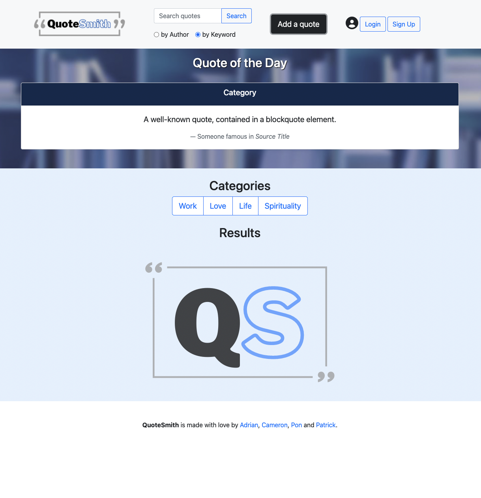

# QuoteSmith

## Purpose

Every week, we have to face the dreaded MONDAY! And MONDAY sometimes seems to extend into the other days of the week. But don’t worry, we’ve got you covered. The QuoteSmith App will be there to give you that boost of encouragement and motivation to face another work week!

Just got your heart broken and you need a reason to believe in love again??? QuoteSmith has got you covered there too, providing you with quotes so romantic, that we’ll have you dreaming of a wedding day in no time.
Looking for inner peace, check out our Spiritual quotes.

QuoteSmith has quotes to help you get through life, because here at QuoteSmith, we believe in the power of quotes!

## Built With

- HTML
- CSS
- Bootstrap
- JavaScript
- Node.js
- Express.js
- MySQL2
- Sequelize
- Handlebars
- Express-session
- bcrypt

## Website

https://github.com/SophoanMeas/quotes-smith

## Contribution

Made with ❤️ by:

- [Adrian](https://github.com/isaiasqb)
- [Pon](https://github.com/SophoanMeas)
- [Patrick](https://github.com/narcpat)
- [Cameron](https://github.com/camkaras)

## Credits

We made extensive use of the Bootstrap documentation https://getbootstrap.com/docs/4.1/getting-started/introduction/ in building the front-end. The following YouTube tutorials were also useful:

- tutorial by "Adrian Twarog" https://youtu.be/qNifU_aQRio
- tutorial by "A Designer Who Codes" https://youtu.be/PwEvMY7nnY8

We made revisited much of what was seen in the course modules 12, 13 and 14 for the back end functionality.

We also made use of the following resources:

- tutorial series by "Esterling Accime" https://youtu.be/erfN7fH7A6s
- https://sequelize.org/v5/manual/models-definition.html
- https://stackoverflow.com/questions/53971268/node-sequelize-find-where-like-wildcard

## Special Thanks

Special thanks to our instructor Ali, and our TAs Mija and Devon who make themselves available when we have questions.
